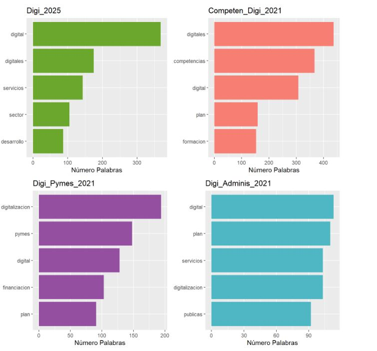

## PERFIL EN CONSTRUCCIÓN, ESTOY MEJORANDO EL CONTENIDO Y LA PRESENTACIÓN. NO TARDARÉ MUCHO!

## Hola, mi nombre es Raúl Alcauza 👋

Soy Ingeniero Técnico Industrial 🤓 👨‍🏫 📚. 
Me apasiona la técnología, y entre otros motivos este fue el que me hizo reconducir mi carrera en todo lo relacionado a analítica de datos y aprendizaje automático (ML). 
Entre mis proyectos, ya sea a nivel personal como laboral:

**Bajo RStudio**

  * Realización de Proyecto de Machine Learning: "Abandono de Clientes de Operadora de Telecomunicaciones". Con y sin pequeña presentación en PowerBI.
    

  * Realización de Proyecto de Machine Learning: "Text Mining. Digitalización España 2021-2025"
    
   // 
  
  * Realización de Proyecto de Machine Learning: "Informe Coronavirus 2021. Sin Impacto Vacunas"
  
  * Realización de Proyecto con Leaflet: "Mapas Interactivos con Leaflet".
    
  * Realización de Proyecto con Selenium: "Automatización de Descarga de archivos excel desde web".

NOTA: Todos estos proyecto, salvo el último, están publicados 

**Bajo Python (con IDE: Visual Studio Code)**

 * Realización de Aplicación desde Telegram con con Teleton: "Automatización para clasificación y Descarga de Archivos".
 * Realización de Aplicación Bot PyWin32+pyTelegramBotApi: "Automatización para clasificación de emails y reenvío a canal"
 * Realización de Aplicación WebScrapping con Selenium.  "Generación de BBDD"

 
