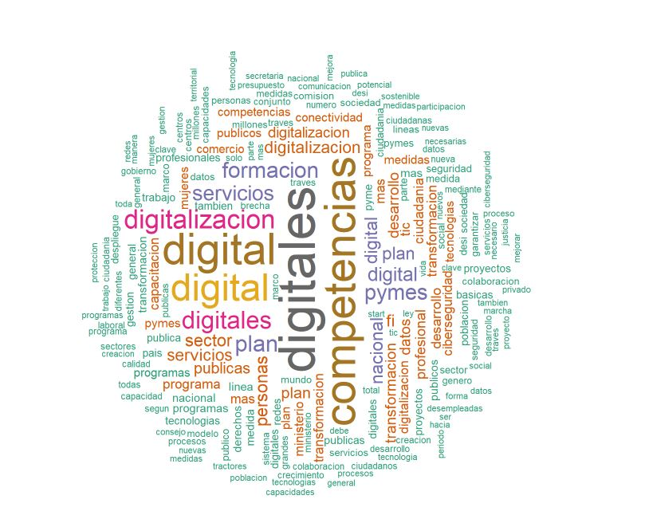

## PERFIL EN CONSTRUCCIÓN, NO TARDARÉ MUCHO!

## Hola, mi nombre es Raúl Alcauza 👋

Soy Ingeniero Técnico Industrial 🤓 👨‍🏫 📚. 
Me apasiona la técnología, y entre otros motivos este fue elque me hizo reconducir mi carrera en todo lo relacionado a analítica de datos y aprendizaje automático (ML). 
Entre mis proyectos, ya sea a nivel personal como laboral:

**Bajo RStudio**

  * Realización de Proyecto de Machine Learning: "Abandono de Clientes de Operadora de Telecomunicaciones". Con y sin pequeña presentación en PowerBI.
  
  * Realización de Proyecto de Machine Learning: "Text Mining. Digitalización España 2021-2025"
  
  * Realización de Proyecto de Machine Learning: "Informe Coronavirus 2021. Sin Impacto Vacunas"
  
  * Realización de Proyecto con Leaflet: "Mapas Interactivos con Leaflet". 

<!--
**raulalcauza/raulalcauza** is a ✨ _special_ ✨ repository because its `README.md` (this file) appears on your GitHub profile.

Here are some ideas to get you started:

- 🔭 I’m currently working on ...
- 🌱 I’m currently learning ...
- 👯 I’m looking to collaborate on ...
- 🤔 I’m looking for help with ...
- 💬 Ask me about ...
- 📫 How to reach me: ...
- 😄 Pronouns: ...
- ⚡ Fun fact: ...
-->
